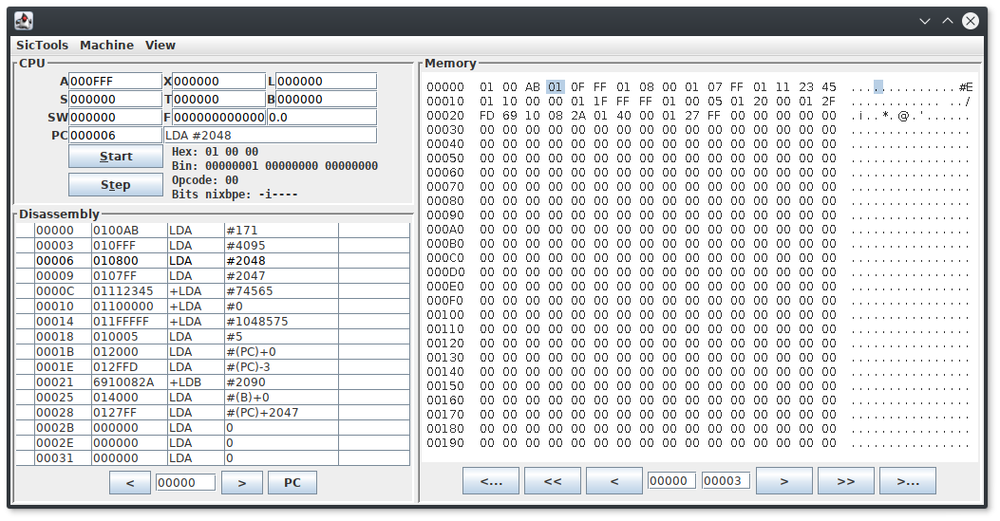

# Getting started with the simulator
## Starting the simulator
SicTools simulator can be started either by simply launching sictools.jar or via the command line:

    java -jar sictools.jar

If launching via command line, you can also supply the path to the asm / obj file you would like to load:

    java -jar sictools.jar examples/zogice.asm
    java -jar sictools.jar examples/zogice.obj

## Basic features
The main simulator view is pretty easy to understand:
* CPU: displays the values of registers, information about current instruction and controls for running step-by-step or starting / stopping the cpu. You can also hover the register values to see the data in different representations.
* Disassembly: displays the disassembly of instructions and current position of PC. You can also _toggle breakpoints_.
* Memory: shows the bytes in memory, where each byte is represented in hexadecimal.

## Input / Output
SIC/XE supports up to 256 devices, which can be accessed via `RD`, `WD` and `TD` instructions.

In order to access devices 0 - 2, you need to start SIC/XE via command line. Devices are mapped in the following way:
* 0 is mapped to standard input
* 1 is mapped to standard output
* 2 is mapped to standard error
* 3 - 255 are mapped to the corresponding `<num>.dev` files, where `<num>` represents the device number in hexadecimal format (writing to device `AA` writes to the file `AA.dev`).

_More examples are available at [SicDemos/stdinout](https://github.com/jurem/SicDemos/tree/master/stdinout)._

## Textual screen
SIC/XE supports a textual screen that can display ASCII characters.

It can be configured in _SicTools -> Settings -> Textual screen_, but default configuration is the following:
* Starting address is located at `0xB800`
* Size is 80 rows * 25 columns
* Font size is 12 pixels
* Address of each pixel can be calculated by `address = screen_origin + y * cols + x`
* Each cell is represented by a single byte which contains an ASCII value.

### Example
If we wanted to display the letters ABC horizontally and vertically (using the default configuration), we would need to write:

| Address | Value | Letter |
| --- | --- | --- |
| 0xB800 | 0x41 | A |
| 0xB801 | 0x42 | B |
| 0xB802 | 0x43 | C |
| ... | ... | ... |
| 0xB19 | 0x42 | B |
| ... | ... | ... |
| 0xB32 | 0x43 | C |

_More examples are available at [SicDemos/text-screen](https://github.com/jurem/SicDemos/tree/master/text-screen)._

## Color graphical screen
SIC/XE also supports a graphical screen that can display pixel in different colors.

It can be configured in _SicTools -> Settings -> Graphical screen_, but default configuration is the following:
* Starting address is located at `0xA000`
* Size is 64 * 64
* Address of each pixel can be calculated by `address = screen_origin + y * cols + x`
* Each pixel is represented by a single byte in the IRGB format (iirrggbb):
    * ii represents intensity - 0, 1, 2, 3 = 20, 40, 60, 80
    * color: (R, G, B) * amp

_More examples are available at [SicDemos/graph-screen](https://github.com/jurem/SicDemos/tree/master/graph-screen)._
