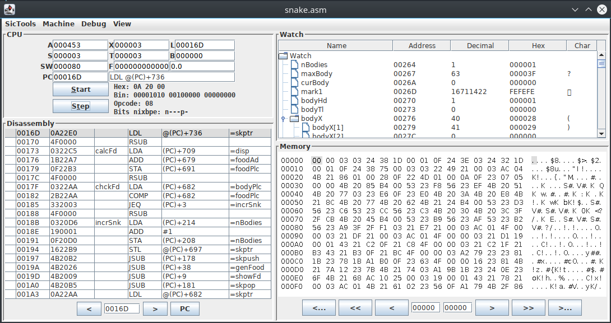

---
# You don't need to edit this file, it's empty on purpose.
# Edit theme's home layout instead if you wanna make some changes
# See: https://jekyllrb.com/docs/themes/#overriding-theme-defaults
layout: default
title: SicTools
menu: root
---
# SicTools
Tools for SIC/XE hypothetical computer from the Leland Beck's book System Software. Includes:
  * Assembler
  * Simulator
  * Linker

Many features are described on the [features page](./features/) and documented in [documentation](./documentation).

See also a companion project [SicDemos](https://github.com/jurem/SicDemos) for several example assembly programs. Available under BSD 2-Clause license.

Installation
------------
SicTools may be downloaded as a JAR file or built from source.

### JAR
Download the latest stable version from [releases](https://github.com/jurem/SicTools/releases). You may need to change the file permissions to allow execution.

### Building from source
Download / clone source code and run make.

    git clone https://github.com/jurem/SicTools.git
    cd SicTools
    make jar

Usage
-----

To run simulator

    java -jar out/make/sictools.jar

To run assembler

    java -cp out/make/sictools.jar sic.Asm source.asm

where source.asm is the file to be compiled.

To get assembler help

    java -cp out/make/sictools.jar sic.Asm -help

To run linker

    java -cp out/make/sictools.jar sic.Link -o out.obj in1.obj in2.obj ...

where out.obj is the output file and in1, in2,... are .obj files to be linked.

To get linker help

    java -cp out/make/sictools.jar sic.Link -help

To get graphical linker interface

    java -cp out/make/sictools.jar sic.Link -g

## To Cite
To cite this work, please use the following reference:
  * Mihelič, J. and Dobravec, T. (2015), SicSim: A simulator of the educational SIC/XE computer for a system-software course. Comput. Appl. Eng. Educ., 23: 137–146. doi: 10.1002/cae.21585
  * [The paper on publisher's page.](http://onlinelibrary.wiley.com/doi/10.1002/cae.21585/abstract)
  * [The paper on researchgate.net.](https://www.researchgate.net/publication/259536133_SicSim_A_simulator_of_the_educational_SICXE_computer_for_a_system-software_course)

Thanks!